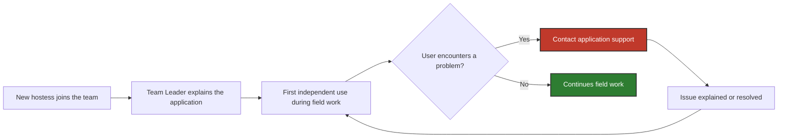

# Problem & Scenario: Hostess Application Onboarding

## 1. AS-IS Problem

New hostesses needed to learn how to use the tablet application before working independently in retail locations. However, there was no standardized application onboarding process.

> [!WARNING]
> In the process this case study is based on, onboarding depended mainly on the **Team Leader**. A new hostess was shown how the application worked, but often used it independently for the first time during her first actual field shift.

This created several recurring problems:

- 📞 **Frequent first-week support requests.** A newly onboarded hostess could contact application support approximately **10 times during her first week**, often with basic usage questions.
- 👤 **Onboarding depended on the individual Team Leader.** The amount and quality of training varied depending on the Team Leader's availability and approach.
- 🏪 **Learning happened during real work.** New hostesses often encountered unfamiliar application functions while already working with customers.
- 🧪 **Training sometimes took place in the production application.** Team Leaders occasionally allowed new hostesses to practice using their own application, which could create test survey records that later had to be manually removed by support.

The scenario below illustrates a typical onboarding path before the process improvement.

---

## 2. Illustrative Scenario: New Hostess Onboarding

> [!NOTE]
> The sequence below illustrates a typical onboarding path. The exact number and type of support requests varied between users.

| Step | What happens | Roles |
| --- | --- | --- |
| **1. New hostess joins the team** | A new hostess is assigned to a field team and needs to learn how to use the tablet application before working independently. | New Hostess, Team Leader |
| **2. Informal application introduction** | The Team Leader explains the basic application workflow. There is no standardized onboarding material or structured training process. | New Hostess, Team Leader         |
| **3. First independent use**             | In many cases, the hostess uses the application independently for the first time during an actual field shift while interacting with customers.                                                | New Hostess                      |
| **4. Support requests**                  | When the hostess encounters an unfamiliar function or is unsure how to proceed, she contacts application support. Many requests concern basic application usage rather than technical defects. | New Hostess, Application Support |
| **5. Repeated support**                  | Similar questions may appear several times during the first days of work. A new hostess could generate approximately 10 support calls during her first week.                                   | New Hostess, Application Support |

In some cases, Team Leaders tried to provide additional hands-on training by allowing new hostesses to practice in their own production application. This could create non-production survey records that later required manual removal by application support.

> [!CAUTION]
> The production application contained real operational data and was not designed as a training environment.

## 3. Pain points summary

| Pain point | Operational impact |
| --- | --- |
| 📞 **Frequent first-week support requests**   | Application support repeatedly handled basic usage questions, increasing support workload |
| 👤 **Team Leader-dependent onboarding**       | Training quality and scope varied between teams and depended on individual availability   |
| 🏪 **First hands-on use during real work**    | New users had to learn the application while simultaneously performing their field duties |
| 🧪 **Training in the production environment** | Practice could create test survey records requiring manual cleanup by support             |

These pain points provide the basis for the functional requirements defined in [`02_requirements.md`](./02_requirements.md)
