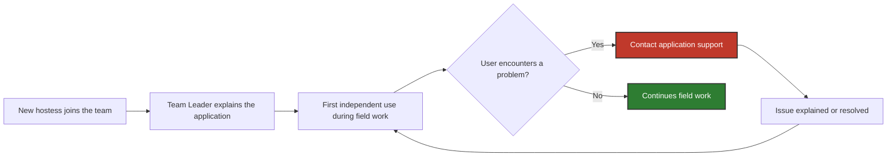

# 1. Problem & Scenario: Hostess Application Onboarding

## 1.1. AS-IS Problem

New hostesses needed to learn how to use the tablet application before working independently in retail locations. However, there was no standardized application onboarding process.

| Actor                                     | Involved in this workflow?             | Role                                                                                               |
| ----------------------------------------- | -------------------------------------- | -------------------------------------------------------------------------------------------------- |
| **New Hostess**                           | ✅                                      | Learns how to use the application and prepares to use it independently during field work           |
| **Team Leader**                           | ✅                                      | Introduces new hostesses to the application and supervises their work. However, there was no standardized application onboarding process.                           |
| **Application Support / Project Manager** | ✅                                      | Provides user support, identifies recurring onboarding issues and coordinates process improvements |
| **Customer / Survey Participant**         | ❌ outside this workflow | Completes a survey during a hostess's field shift after purchasing selected products               |

This created several recurring pain points:

- 📞 **Frequent first-week support requests.** A newly onboarded hostess could contact application support approximately **10 times during her first week**, often with basic usage questions.
- 👤 **Team Leader-dependent onboarding.** The amount and quality of training varied depending on the Team Leader's availability and approach.
- 🏪 **Learning happened during real work.** New hostesses often encountered unfamiliar application functions while already working with customers.
- 🧪 **Training in the production environment.** Team Leaders occasionally allowed new hostesses to practice using their own application, which could create test survey records that later had to be manually removed by support.
- ❓ **No reliable visibility of individual training completion.** The Team Leader knew whether a hostess had completed the training in the Team Leader’s production application, but the system did not record which individual hostess had completed it.

These pain points provide the basis for the functional requirements defined in [`02_requirements.md`](./02_requirements.md)

---

## 1.2. Illustrative Scenario: New Hostess Onboarding

The scenario below illustrates a typical onboarding path before the process improvement.

> The exact number and type of support requests varied between users.

| Step | What happens | Roles |
| --- | --- | --- |
| **1. New hostess joins the team** | A new hostess is assigned to a field team and needs to learn how to use the tablet application before working independently. | New Hostess, Team Leader |
| **2. Informal application introduction** | The Team Leader explains the basic application workflow. There is no standardized onboarding material or structured training process. | New Hostess, Team Leader         |
| **3. First independent use**             | In many cases, the hostess uses the application independently for the first time during an actual field shift while interacting with customers.                                                | New Hostess                      |
| **4. Support requests**                  | When the hostess encounters an unfamiliar function or is unsure how to proceed, she contacts application support. Many requests concern basic application usage rather than technical defects. | New Hostess, Application Support |
| **5. Repeated support**                  | Similar questions may appear several times during the first days of work. A new hostess could generate approximately 10 support calls during her first week.                                   | New Hostess, Application Support |

In some cases, Team Leaders tried to provide additional hands-on training by allowing new hostesses to practice in their own production application. This could create non-production survey records that later required manual removal by application support.
