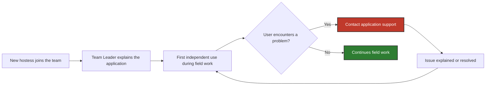

# 1. Problem & Scenario: Hostess Application Onboarding

## 1.1. AS-IS Problem

New hostesses needed to learn how to use the tablet application before working independently in retail locations. However, there was no standardized application onboarding process.

| Actor                                     |  Role                                                                                               |
| ----------------------------------------- | -------------------------------------------------------------------------------------------------- |
| **New Hostess**                           |  Learns to use the application before working ndependently    |
| **Team Leader**                           |  Introduces new hostesses to the application and supervises their work                           |
| **Application Support / Project Manager** | Provides support, identifies recurring onboarding issues and coordinates improvements |

This created several recurring pain points:

- 📞 **Frequent first-week support requests.** A newly onboarded hostess could contact application support approximately **10 times during her first week**, often with basic usage questions.
- 👤 **Team Leader-dependent onboarding.** The amount and quality of training varied depending on the Team Leader's availability and approach.
- 🏪 **Learning happened during real work.** New hostesses often encountered unfamiliar application functions while already working with customers.
- 🧪 **Training in the production environment.** Team Leaders occasionally allowed new hostesses to practice using their own application, which could create test survey records that later had to be manually removed by support.
- ❓ **No reliable visibility of individual training completion.** The Team Leader knew whether a hostess had completed the training in the Team Leader’s production application, but the system did not record which individual hostess had completed it.

These pain points provide the basis for the functional requirements defined in [`02_requirements.md`](./02_requirements.md)

---

## 1.2. Illustrative Scenario: New Hostess Onboarding

The onboarding process relied primarily on an informal introduction by the Team Leader. New hostesses often encountered application-related questions only after starting independent field work and contacted Application Support for help. As a result, the same basic usage issues could recur during the first days of work.

> The exact number and type of support requests varied between users.

<em>Figure 1. AS-IS hostess onboarding and support flow.</em>

---
[← README](../README.md) · **01 Problem & Scenario** · [02 Requirements & Specification →](./02_requirements.md)
